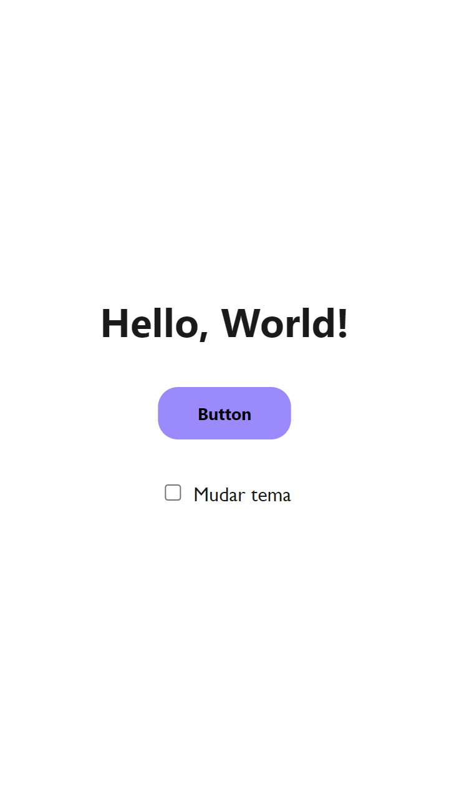
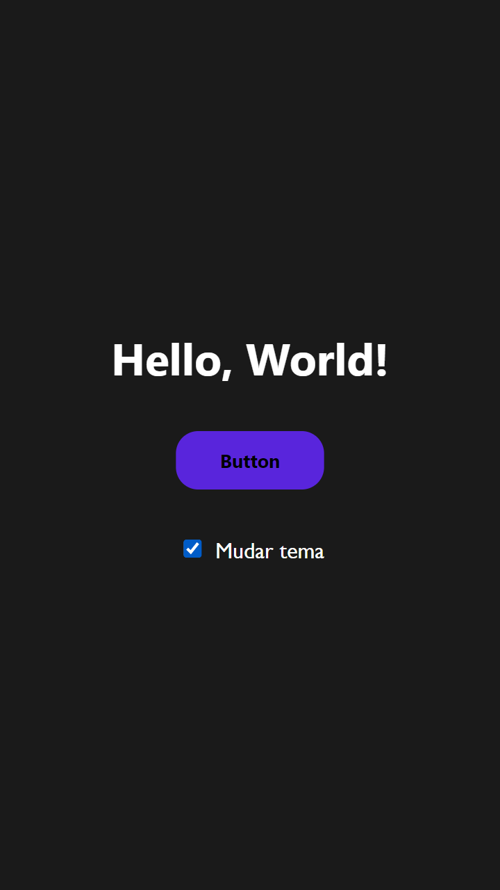

# Light Mode e Dark Mode

Alternando entre Light Mode/Dark Mode com CSS e Javascript Puro

 

 
- 🔗[Clique aqui para acessar](https://alineviana.github.io/dark-mode/)

 

## 🖥️ Tecnologias utilizadas

- HTML5  
- CSS3
- JavaScript